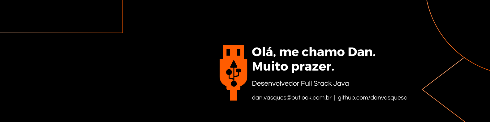

  
  
    
      
        

### Sobre mim

👋 Olá! Sou Dan Vasques. Possuo experiência de mais de 2 anos como Analista de Tecnologias Educacionais e Professor, com atuação em suporte técnico e implementação de sistemas educacionais. Atualmente, direciono meu trabalho para o desenvolvimento de soluções com Java, HTML, CSS e Git, utilizando minha bagagem única para resolver problemas de forma eficiente. Minha trajetória como Analista de Tecnologias Educacionais e Professor me proporciona habilidades essenciais e um diferencial em resolução de problemas, comunicação clara e organização, que enriquecem minha atuação como desenvolvedor.

 

### Principais Projetos
| Prioridade |    Projetos                                               | Linguagens e/ou Ferramentas                     |
|   :---:    |     :---                                                  |          :---                                   |
|    1º      | [Plataforma de Gestão de Atividades Escolares][1]         | ![HTML5][3] ![CSS][4] ![Git][6] ![VS Code][5]   |
|    2º      | [Exercícios em Java - Prática e Aprendizado][2]           | ![Java][10] ![Eclipse][11] ![Git][6]            | 

[1]: https://github.com/danvasquesc/projeto-plataforma-atividades-escolares
[2]: https://github.com/danvasquesc/exercicios_udemy_java

 

### Ferramentas que utilizo (ordem alfabética)

![Canva][12]
![CSS3][4]
![Eclipse][11]
![Frontend Editor][7]
![Git][6]
![HTML5][3]
![Java][10]
![Microsoft Office][9]
![Notion][8]
![Visual Studio Code][5]

[3]: https://img.shields.io/badge/html5-%23E34F26.svg?style=for-the-badge&logo=html5&logoColor=white
[4]: https://img.shields.io/badge/css3-%231572B6.svg?style=for-the-badge&logo=css3&logoColor=white
[5]: https://img.shields.io/badge/Visual%20Studio%20Code-0078d7.svg?style=for-the-badge&logo=visual-studio-code&logoColor=white
[6]: https://img.shields.io/badge/git-%23F05033.svg?style=for-the-badge&logo=git&logoColor=white
[7]: https://img.shields.io/badge/Front%20end%20Editor-6eff51?style=for-the-badge&logo=front-end-editor&logoColor=white
[8]: https://img.shields.io/badge/Notion-%23000000.svg?style=for-the-badge&logo=notion&logoColor=white
[9]: https://img.shields.io/badge/Microsoft_Office-D83B01?style=for-the-badge&logo=microsoft-office&logoColor=white
[10]: https://img.shields.io/badge/java-%23ED8B00.svg?style=for-the-badge&logo=openjdk&logoColor=white
[11]: https://img.shields.io/badge/Eclipse-FE7A16.svg?style=for-the-badge&logo=Eclipse&logoColor=white
[12]: https://img.shields.io/badge/Canva-%2300C4CC.svg?style=for-the-badge&logo=Canva&logoColor=white

 

 

#### Feito por [Dan!](https://github.com/danvasquesc) ✨
