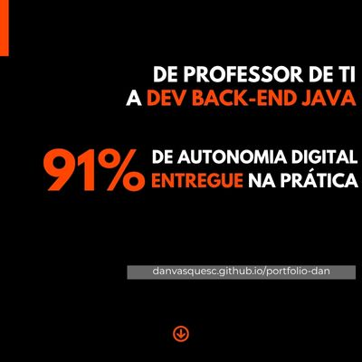

### 👋 Olá! Sou Dan Vasques  

 
Graduando em <strong>Análise e Desenvolvimento de Sistemas</strong> (3º semestre), com conhecimentos em <strong>Java</strong>, <strong>Spring Boot</strong>, <strong>HTML</strong>, <strong>CSS</strong> e <strong>Git</strong>. Atualmente desenvolvendo <strong>projeto de extensão acadêmica</strong> com aplicação prática na escola onde atuo, voltado ao <strong>ensino de programação</strong>, formatação e manutenção de computadores para +60 alunos. Possuo quase três anos de experiência como Professor de Apoio à Tecnologia da Informação, atuando com suporte técnico, infraestrutura de TI, gestão de sistemas escolares e capacitação de usuários.

<strong>Destaques:
- 100% de operacionalidade</strong> nas Provas Paulistas, com gerenciamento completo do ambiente digital;
- <strong>91% de autonomia digital</strong> da equipe escolar, resultado de treinamentos em Google Workspace, Windows, Office e sistemas educacionais.

<strong>Tecnologias</strong> 
    

    

<strong>Entre em contato</strong> ⤵️

  
    
    
    
    

 

## Principais Projetos
| Prioridade |    Projetos                                       | Tecnologias                    |
|   :---:    |     :---                                          |          :---                                   |
|    1º      | [Prática e Aprendizado em Java][2]                |               |
|    2º      | [Plataforma de Gestão de Atividades Escolares][1] |      	  | 

[1]: https://github.com/danvasquesc/projeto-plataforma-atividades-escolares
[2]: https://github.com/danvasquesc/exercicios_java

 

#### Feito por [Dan!](https://github.com/danvasquesc) ✨
